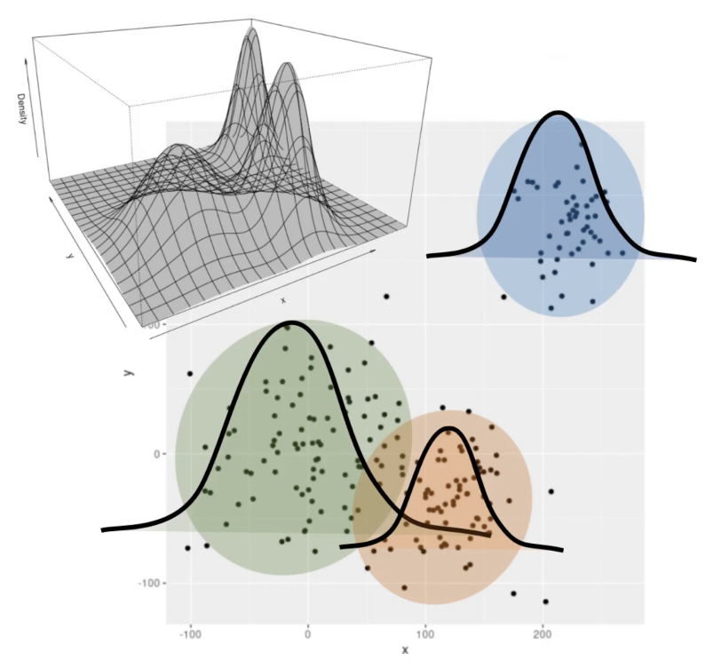
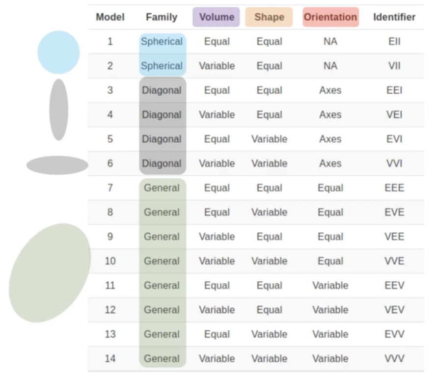
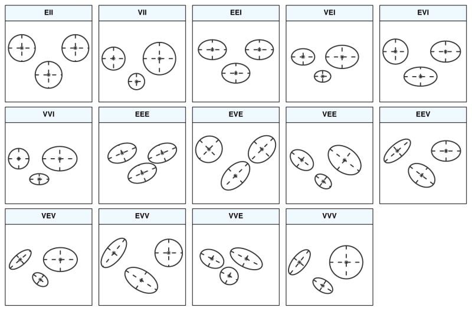
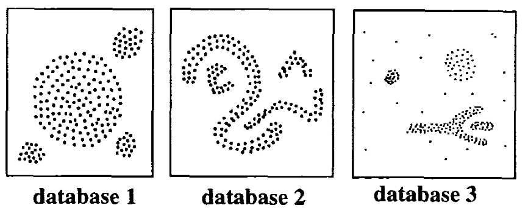
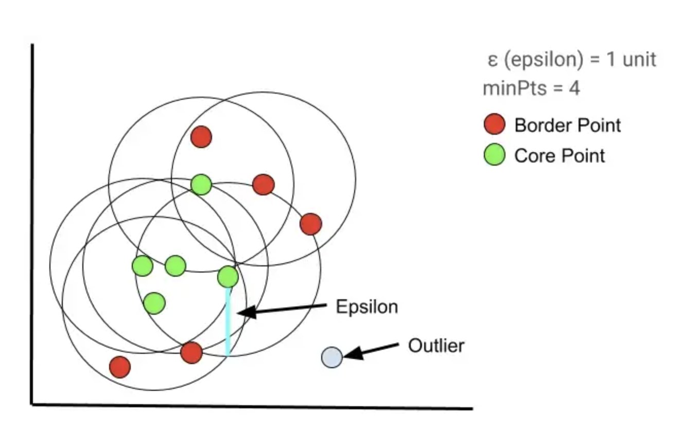

```{=html}
<style>
pre code, pre, code {
  white-space: pre !important;
  overflow-x: scroll !important;
  word-break: keep-all !important;
  word-wrap: initial !important;
}
</style>
```
```{r, include=FALSE}
# set code chunk options
knitr::opts_chunk$set(echo = TRUE, 
                      fig.align = 'center',
                      cache = TRUE)

# allow scrolling for long code
options(width = 200)
```

# Introduction

In unsupervised learning methods, inferences are drawn from data that do not contain a labelled output variable. These exploratory data analysis techniques allow us to analyze multivariate data sets and find interesting relationships between observations. More specifically, clustering is a type of unsupervised machine learning method that involves dividing the data set into a certain number of groups (called clusters) in such a manner that the data points belonging to a cluster have similar characteristics. It is done to segregate the groups with similar traits such that the distances between the data points within each cluster is minimal. In other words, the clusters are regions where the density of similar data points is high.

The inferences that are drawn from the data are subjective as there is no criterion for "good" clustering. The type of algorithm we use decides how the clusters will be created.

Clustering can be categorized into two broad types. In hard clustering, one data point can belong to one cluster only. But in soft clustering, the output provided is a probability likelihood of a data point belonging to each of the pre-defined numbers of clusters. Here are several examples of different types of clustering methods: Density-Based Clustering, Hierarchical Clustering, Fuzzy Clustering, Grid-Based Clustering, and so on. In this project, we will mainly focus on three on them: Hierarchical Clustering, Model-Based Clustering, and Density-Based Clustering.

To demonstrate these clustering methods, we will use a [country-level dataset]((https://www.kaggle.com/datasets/rohan0301/unsupervised-learning-on-country-data)) that includes 167 unique observations, which means not every country is represented. The descriptions of the variables in this dataset are listed in the codebook, which can be found in `data/codebook.csv`.

In our analysis, we will use `country` as the row names. Since there is no labelled response and all of the other predictors are qualitative, then we can compute the distances between observations. This allows us to use clustering methods to analyze this dataset.

**Objective:** We want to categorize countries using socio-economic and health factors that determine the overall development of each country (from the [Kaggle description](https://www.kaggle.com/datasets/rohan0301/unsupervised-learning-on-country-data)).

We load in the necessary packages and the country data.

```{r, message=FALSE}
# load packages
library(tidyverse)
library(factoextra)
library(cluster)
library(dendextend)
library(mclust)
library(dbscan)

# read data
countries <- read.csv("../data/country-data.csv")

# use the countries as the row names
df <- countries %>%
  column_to_rownames(var = "country")

# show the first few rows of the dataframe
head(df)
```

# Hierarchical clustering

In hierarchical clustering, we use the Euclidean distance as our similarity measure between each observation (in this case, the countries in our data set). The Euclidean distance is the most common distance measure used when the variables are continuous. This value is a non-negative measure that calculated the distance between two points. This distance is quantified based upon the Pythagorean Theorem. Here we also performed a scaling of our data in order to ensure that the scale of each variable is the same. This is done before we look at the optimal number of clusters.

At the beginning of hierarchical clustering all objects start as an individual cluster and are joined with a linkage method. The linkages works by calculating either the differences or similarities among the objects. The two objects that are closest together are linked together and form a cluster. This linkage process is repeated, forming clusters until there is only one cluster left. There are many linkage methods one can use such as `Single Linkage`, `Complete Linkage`, `Centroid Linkage`, `Average Linkage`, and `Ward's Linkage` among others. One of the most common is Single Linkage, this method finds the two clusters with the closest minimum distance. Single linkage can result in extended, trailing clusters in which single observations are fused one-at-a-time. It will repeat until there is a single cluster left. The linkage method we used was Complete Linkage, which is also another common method. This method finds the two clusters with the closest maximum distance and merges them together. In this case it records the largest of the dissimilarity values. This process is repeated until there is a single cluster left.

Since we don't specify the number of clusters we want beforehand, like in K-means clustering, we produce a dendrogram which is an upside down tree like structure that represents the observations. In this diagram we are able to observe the clusterings for each possible number of clusters from 1 to $n$. A dendrogram is seen as an advantage over K-means clustering because we can see how each possible clusters affects the data as opposed to specifying the number of clusters at the beginning and having to tune. In practice one can select an appropriate number of clusters for the data by just analyzing the dendrogram and based on the heights of the fusion and the number of clusters desired.

## Optimal number of clusters {.tabset}

[Unlike $k$-means clustering, we don't have to specify the number of clusters beforehand. But then how many clusters should we use?]

Determining the optimal number of clusters is subjective and heavily depends on which method is used for measuring the similarities and parameters.To determine the optimal number of clusters to use we used the `fviz_nbclust()` function which determines and visualizes the optimal number using a variety of methods. These include the within cluster sums of squares(elbow method), average silhouette, and gap statistics. Each method will give its optimal number of clusters to use.

[See [here](https://towardsdatascience.com/how-many-clusters-6b3f220f0ef5)]

### Elbow method

-   Looks at the total within-cluster sum of squares (WSS)
-   Similar to proportion of variance explained (PVE) plot in PCA
-   The optimal number of clusters is the point where the plot appears to bend
-   Lower WSS = better

```{r}
# best = 4 clusters (not much improvement after 4 clusters)
fviz_nbclust(df, 
             hcut, 
             method = "wss")
```

### Average silhouette method

-   Compute clustering algorithm for different values of k, then calculate the average silhouette of observations for each k
-   The maximum location in the plotted curve is considered as the appropriate number of clusters
-   Determines how well each object lies within its cluster
-   Higher average silhouette = better

```{r}
# best = 2 clusters
fviz_nbclust(df, 
             hcut, 
             method = "silhouette")
```

### Gap statistic method

-   Compares the total within intra-cluster variation for different values of $k$ with randomly drawn samples
-   Choose $k$ such that the gap statistic is within 1 standard deviation of the gap statistic at $k + 1$
-   Higher gap statistic = better

```{r}
set.seed(123)
gap_stat <- clusGap(df,
                    hcut,
                    K.max = 10, # number of clusters to consider
                    B = 500)    # number of samples to bootstrap

# best = 3 clusters
fviz_gap_stat(gap_stat)
```

## Dendrograms {.tabset}

To visually show the hierarchical clusters, we can plot diagrams called *dendrograms* for each of the following clusters. We use $k = 2, 3, 4$ clusters based on the optimal number of clusters in the previous section.

[Identify changes]

### $k = 2$ clusters

```{r, fig.height=20}
df %>%
  scale() %>%                # scale and center the columns
  dist() %>%                 # get the Euclidean distances between rows             
  hclust() %>%               # apply hierarchical clustering
  as.dendrogram() %>%        # turn the cluster output into a dendrogram
  set("labels_cex", 0.4) %>% # make the font size smaller
  color_branches(k = 2) %>%  # color the branches based on the 2 clusters
  color_labels(k = 2) %>%    # color the labels based on the 2 clusters
  plot(horiz = TRUE)         # make the labels appear on the right
```

### $k = 3$ clusters

```{r, fig.height=20}
df %>%
  scale() %>%                # scale and center the columns
  dist() %>%                 # get the Euclidean distances between rows  
  hclust() %>%               # apply hierarchical clustering
  as.dendrogram() %>%        # turn the cluster output into a dendrogram
  set("labels_cex", 0.4) %>% # make the font size smaller
  color_branches(k = 3) %>%  # color the branches based on the 3 clusters
  color_labels(k = 3) %>%    # color the labels based on the 3 clusters
  plot(horiz = TRUE)         # make the labels appear on the right
```

### $k = 4$ clusters

```{r, fig.height=20}
df %>%
  scale() %>%                # scale and center the columns
  dist() %>%                 # get the Euclidean distances between rows  
  hclust() %>%               # apply hierarchical clustering
  as.dendrogram() %>%        # turn the cluster output into a dendrogram
  set("labels_cex", 0.4) %>% # make the font size smaller
  color_branches(k = 4) %>%  # color the branches based on the 4 clusters
  color_labels(k = 4) %>%    # color the labels based on the 4 clusters
  plot(horiz = TRUE)         # make the labels appear on the right
```

## Map clusters {.tabset}

The dendrograms can be difficult to read since there are a lot of countries -- `r length(row.names(df))` in total! Luckily, since we are working with countries, we can also plot the clusters onto a world map. Below are some of the functions that we'll use to make our maps.

```{r}
# perform hierarchical clustering and get k clusters
k_hclust <- function(.df, k) {
  .df %>%
    scale() %>%  # scale and center the columns
    dist() %>%   # get the Euclidean distances between rows
    hclust() %>% # apply hierarchical clustering
    cutree(k)    # separate observations into k clusters
}

# turn the cluster output into a dataframe
clust_to_df <- function(.clust) {
  .clust %>%                              # must be a named vector: clusters as values, countries as names
    cbind() %>%                           # combine countries and clusters by column
    data.frame() %>%                      # convert to data frame
    rename(cluster = 1) %>%               # rename the first column as 'cluster'
    mutate(cluster = factor(cluster)) %>% # convert the 'cluster' column into a factor
    rownames_to_column("country")         # turn the row names (countries) into a column called 'country'
}

# rename countries to be able to plot them
rename_countries <- function(.df) {
  .df %>%
    # replace original country names with new country names (important for the plot_map() function!)
    mutate(across('country', str_replace, 'Antigua and Barbuda', 'Antigua'),
           across('country', str_replace, 'Congo, Dem. Rep.', 'Democratic Republic of the Congo'),
           across('country', str_replace, 'Congo, Rep.', 'Republic of Congo'),
           across('country', str_replace, 'Cote d\'Ivoire', 'Ivory Coast'),
           across('country', str_replace, 'Kyrgyz Republic', 'Kyrgyzstan'),
           across('country', str_replace, 'Lao', 'Laos'),
           across('country', str_replace, 'Macedonia, FYR', 'North Macedonia'),
           across('country', str_replace, 'Micronesia, Fed. Sts.', 'Micronesia'),
           across('country', str_replace, 'Slovak Republic', 'Slovakia'),
           across('country', str_replace, 'St. Vincent and the Grenadines', 'Saint Vincent'),
           across('country', str_replace, 'United Kingdom', 'UK'),
           across('country', str_replace, 'United States', 'USA')) %>%
    # add separate rows for countries that were originally grouped together
    add_row(country = 'Barbuda', cluster = filter(., country == 'Antigua') %>% getElement('cluster')) %>%
    add_row(country = 'Grenadines', cluster = filter(., country == 'Saint Vincent') %>% getElement('cluster'))
}

# plots the clusters onto the world map
plot_map <- function(.df) {
  # dataframe containing information (e.g. latitude, longitude) on all countries
  world <- map_data("world")
  
  world %>%
    # (left) join 'world' dataframe with another dataframe at columns with the country names
    left_join(.df, by = c("region" = "country")) %>%
    # plot the map
    ggplot() +
      geom_polygon(aes(x = long, y = lat, fill = cluster, group = group),
                   color = "white") +
      coord_fixed(1.3) +
      theme(legend.position = "top")
}
```

If you're curious, this is how we determined what names to change.

```{r}
# dataframe containing information (e.g. latitude, longitude) on all countries
world <- map_data("world")

# get unique countries in 'df' and 'world'
unique_countries_df <- row.names(df) %>% unique() %>% sort()
unique_countries_world <- world$region %>% unique() %>% sort()

# get all countries that occur in 'df' but not in 'world'
setdiff(unique_countries_df, unique_countries_world)
```

Use the tabs to choose between different numbers of clusters obtained from hierarchical clustering. Note that some countries are not included in this dataset (shaded in gray), such as Mexico and Greenland.

From 2 clusters to 3 clusters there is a very small change that may not be noticeable at first glance. The method creates a separate cluster for the countries Malta, Luxembourg,and Singapore. Then when we go from 3 to 4 clusters the method makes Nigeria it's own cluster. \### $k = 2$ clusters

```{r, out.width='150%'}
df %>%
  k_hclust(2) %>%
  clust_to_df() %>%
  rename_countries() %>%
  plot_map()
```

### $k = 3$ clusters

```{r, out.width='150%'}
df %>%
  k_hclust(3) %>%
  clust_to_df() %>%
  rename_countries() %>%
  plot_map()
```

### $k = 4$ clusters

```{r, out.width='150%'}
df %>%
  k_hclust(4) %>%
  clust_to_df() %>%
  rename_countries() %>%
  plot_map()
```

# Model-based clustering

Clusters are not necessarily strict boundaries -- for example, if a point is further away from the center of a cluster, then it may be less likely to be in that cluster. To account for this uncertainty, one assumption we can make is that the clusters follow a (multivariate) normal distribution, which is a probability density function. (More formally, this method is called Gaussian mixture models clustering.) An example of this with two variables is shown below.

<br>

<center>{width="357"}</center>

</br>

To define such a distribution for a given set of observations, we need to find its covariance matrix. We won't get into the mathematical details here (see [this paper](https://stat.uw.edu/sites/default/files/files/reports/2012/tr597.pdf) for a more rigorous treatment), but the basic idea is that by modifying this matrix, we can create different types of clusters that are determined by three aspects:

-   **Volume:** the amount of space that each cluster contains
    -   *Equal:* all clusters have the same volume
    -   *Variable:* the clusters can have different volumes
-   **Shape:** the width of the clusters
    -   *Equal:* all clusters have the same shape (e.g. all spherical, all elliptical)
    -   *Variable:* the clusters can have different shapes
-   **Orientation:** how the clusters are positioned in space and what direction it is facing
    -   *NA:* used for spherical clusters (since rotating these clusters doesn't change the groups)
    -   *Axes:* all clusters are parallel to the axis/axes
    -   *Equal:* all clusters have the same orientation
    -   *Variable:* the clusters can have different orientations

Below is a table containing all of the possible types of clusters. The identifiers are made up of three letters, which indicate what volume, shape, and orientation the clusters have, respectively. These are labeled as follows:

-   *E* = "equal"
-   *V* = "variable"
-   *I* = "coordinate axes"

<br>

<center>{width="453"}</center>

</br>

Here are some visuals to accompany the table above.

<br>

<center>{width="495"}</center>

</br>

To identify both the optimal model and number of clusters, the Bayesian Information Criterion (BIC) is used since it penalizes models with more parameters, i.e. the "general" clusters are penalized more since they have more variability (and therefore more parameters). Many combinations of different models and numbers and clusters are fit, and the combination that yields the maximum BIC is chosen as the "best" one.

<details>

<summary>**Why do we maximize the BIC? Aren't we supposed to minimize it?**</summary>

Good question! Just to give some context, the BIC allows us to compare models with different numbers of parameters. From [this article](https://towardsdatascience.com/an-intuitive-explanation-of-the-bayesian-information-criterion-71a7a3d3a5c5), we want to minimize the BIC, which is defined as $$\text{BIC} = k \ln{(n)} - 2 \ln{(\hat{L})}$$ where

-   $k$ is the number of model parameters,
-   $n$ is the number of data points, and
-   $L$ is the maximum likelihood function (i.e. how likely our data explained by a given model).

Having more parameters tends to produce more flexible models that fit the model better and thus yield a higher likelihood (i.e. higher $\hat{L}$). This means the second term $-2 \ln{(\hat{L})}$ would become more negative, which decreases the BIC.

However, we usually want to explain the data by using as few parameters as possible -- this is called the principle of parsimony. Having too many parameters can also risk overfitting the data, which may not generalize well to new data. As a result, we penalize models with more parameters. In math terms, we have a larger $k$, which makes the first term $k \ln{(n)}$ bigger, which in turn increases the BIC.

Then why do we maximize the BIC here? It turns out that in [the paper (p. 54)](https://stat.uw.edu/sites/default/files/files/reports/2012/tr597.pdf) associated with the `mclust` package (which we use to run this algorithm), the BIC is roughly defined as $$\text{BIC} = 2 \ln{(\hat{L})} - k \ln{(n)}$$

This is essentially taking the negative of our BIC equation from earlier, hence why the algorithm tries to maximize the BIC rather than minimizing it.

</details>

## Choosing the best model {.tabset}

### Run the algorithm

We use the the `Mclust()` function in the `mclust` package to run this algorithm. The code below may take a minute or two since it is fitting all of the possible models using different numbers of clusters. The output includes the optimal model and number of clusters, along with how many observations are in each cluster.

```{r}
# run model-based clustering algorithm
mb <- Mclust(df)

# output model and number of clusters chosen
summary(mb)
```

### Classification plots

We can see how the points are classified for each pair of variables in the dataset using the chosen model and number of clusters.

```{r}
# create classification plots
plot(mb, what = "classification")
```

### BIC plot

We can also compare all of the models at different numbers of clusters. Higher BIC suggests a better model.

```{r}
# create BIC plot
plot(mb, what = "BIC")
```

## Map clusters

Like before, we plot our clusters onto the world map. Notice that we have more clusters here than when we used hierachical clustering.

```{r, out.width='150%'}
# plot map clusters
mb$classification %>%
  clust_to_df() %>%
  rename_countries() %>%
  plot_map()
```

# Density-based clustering

Unlike the other two algorithms that mainly derive from the how computer calculated the clusters, the basic idea behind the [density-based clustering approach](https://developers.google.com/machine-learning/clustering/clustering-algorithms) is derived from a human intuitive clustering method. It means that the results of clustering calculated from a density-based method would be similar to how people classify the clusters through graphs only based on their eyes. For example, looking at the figure below, it is easy for us to identify the different clusters only based on our eyes because of the various dense regions of points on the graph.

[](https://www.datanovia.com/en/lessons/dbscan-density-based-clustering-essentials/)

## DBSCAN algorithm

[DBSCAN](https://www.geeksforgeeks.org/dbscan-clustering-in-r-programming/), or "Density-Based Spatial Clustering of Applications with Noise", is a commonly used unsupervised clustering Machine Learning algorithm for density-based clustering approach. The idea that uses are density reachability and connectivity. The data would be divided into clusters with similar characteristics. However, unlike the hierarchical clustering, the number of clusters do not needed to be specified in advance. A cluster is defined as a maximum set of densely connected points. It discovers clusters of arbitrary shapes in spatial databases with noise.

## Important concepts

[](https://towardsdatascience.com/explaining-dbscan-clustering-18eaf5c83b31)

Two required parameters in the DBSCAN algorithm are:

-   [*eps*](https://towardsdatascience.com/explaining-dbscan-clustering-18eaf5c83b31) : Eps stands for "Epsilon", which stands for the maximum radius of the neighborhood or the clusters, and is shown as the blue line in the above figure. The data points will be included in the clusters if their mutual distance is less than or equal to the value of epsilon. For the DBSCAN algorithm, larger eps will create broader clusters, which contains more data points; smaller eps will narrow clusters, which contains less data points. However, if eps is chosen too small for the dataset, a large part of the data points would be considered as the noise points and not be included in the clusters; if eps is chosen too large for the dataset, clusters will be merged and the majority of the data points will be included in one same cluster.

-   [*MinPts*](http://www.sefidian.com/2020/12/18/how-to-determine-epsilon-and-minpts-parameters-of-dbscan-clustering/): MinPts stands for "the minimum number of data points contains within the radius of a neighborhood" to be considered as a cluster, which is the value of 4 in the above figure. In the DBSCAN algorithm, the value MinPts should be at least 3 to be used as a valid value. A smaller value of MinPts used, more clusters and more outliers will be produced; a larger value of MinPts used, more robust clusters will be created.

By changing the above two hyperparameter, the result of clustering may be varied.

Other important terms to understand how DBSCAN works are:

-   [*Core points*](https://www.dominodatalab.com/blog/topology-and-density-based-clustering): A point is a core point if it has more than MinPts points within eps, which is randomly selected in the algorithm and is the foundation of the clusters, which are the green points shown in the above figure.

-   [*Border points*](https://www.dominodatalab.com/blog/topology-and-density-based-clustering): A point is included in the neighborhoods or the clusters that is not the core points, which are the red points shown in the above figure.

-   [*Noise points/ Outliers*](https://www.geeksforgeeks.org/dbscan-clustering-in-ml-density-based-clustering/): The points that are neither core points nor are they close enough to a cluster to be defined as border points. Noise points are not assigned to any clusters and sometimes may be considered as anomalous points in the dataset, which are the grey points shown in the above figure.

## Determining best parameters

```{r}
#install.packages("fpc")
#install.packages("dbscan")
#install.packages("factoextra")
```

### Determining eps: Elbow Method

In the DBSCAN algorithm, the best eps value is commonly found with a [k-distance graph](https://towardsdatascience.com/explaining-dbscan-clustering-18eaf5c83b31), where the value of k should equal to the value of MinPts. For this graph, x-axis contains all data points in the dataset and y-axis stands for the average distances of the data points. The best eps may chosen by looking at the elbow of the k-distance line. For example, after scaling our data, it plots a k-distance graph with a k value of 5 below. From this plot, if we choose MinPts equal to 5, the value of eps should be between 2 to 4.

```{r}
scale.df <- df %>% scale()
df.matrix <- as.matrix(scale.df)
kNNdistplot(df.matrix, k=5)
abline(h=2.5, col="red")
```

### Determining MinPts

-   [Approach 1](http://www.sefidian.com/2020/12/18/how-to-determine-epsilon-and-minpts-parameters-of-dbscan-clustering/): According to a rule of thumb, the best value of MinPts can be determined by the value of the number of dimensions D in the data set, which means that ${MinPts}\geq\text{D} + 1$. And in general, the value of MinPts should be ${MinPts} = \text{D} * 2$. For our data set, the dimensionality is 9 so the best MinPts should be 18 with this approach.

-   [Approach 2](https://stackoverflow.com/questions/12893492/choosing-eps-and-minpts-for-dbscan-r): Under the most cases which we do not know the domain knowledge, we can also find the best value of MinPts by $ln(n)$, where n is the number of points that needed to be clustered. For our data set, the n should be 167 and the MinPts should be 5 or 6 with this approach.

## Tuning parameters {.tabset}

### eps = 3, MinPts = 18

```{r}
set.seed(1)
db <- fpc::dbscan(scale.df, eps = 3, MinPts = 18)

fviz_cluster(db, data = scale.df, stand = FALSE,
             ellipse = FALSE, show.clust.cent = FALSE,
             geom = "point",palette = "jco", ggtheme = theme_classic())
```

*For this plot, we select the value of MinPts based on the first approach, which produces only one cluster.*

### eps = 3, MinPts = 5

```{r, warning = FALSE}
set.seed(1)
db1 <- dbscan(scale.df, eps = 3, MinPts = 5)

fviz_cluster(db1, data = scale.df, stand = FALSE,
             ellipse = FALSE, show.clust.cent = FALSE,
             geom = "point",palette = "jco", ggtheme = theme_classic())
```

*For this plot, we select the value of MinPts based on the second approach, which produces only one cluster.*

### eps = 6, MinPts = 5

```{r}
set.seed(1)
db <- fpc::dbscan(scale.df, eps = 6, MinPts = 5)

fviz_cluster(db, data = scale.df, stand = FALSE,
             ellipse = FALSE, show.clust.cent = FALSE,
             geom = "point",palette = "jco", ggtheme = theme_classic())
```

*For this plot, as eps becomes larger, more noise points are also included in the cluster.*

### eps = 1, MinPts = 5

```{r}
set.seed(1)
db <- fpc::dbscan(scale.df, eps = 1, MinPts = 5)

fviz_cluster(db, data = scale.df, stand = FALSE,
             ellipse = FALSE, show.clust.cent = FALSE,
             geom = "point",palette = "jco", ggtheme = theme_classic())
```

*For this plot, as eps becomes smaller, more clusters exists. However, most of data points also be excluded from those clusters and become noise points.*

## Final combination: eps = 3, MinPts = 5

After comparing the results of different combinations of eps and MinPts, we decided to use the one with eps = 3 and MinPts = 5 as our final parameter combination.

## Check PCA

Since we only got one cluster for this algorithm, we can further use PCA to check if this cluster pattern is correct or not.

```{r}
# check PCA
pr.out <- prcomp(scale.df,
                 scale =TRUE,
                 center = TRUE)

plot(pr.out$x[,1], pr.out$x[,2],
     xlab = 'PC1', ylab = 'PC2')
```

After checking the [PCA](https://stackoverflow.com/questions/48051800/why-dbscan-clustering-returns-single-cluster-on-movie-lens-data-set) plot, it is easy to see that PCA plot also got a dense single group on the graph, which may be the reason why we only got one single cluster in DBSCAN.

## Map clusters

```{r, out.width='150%'}
# add country names to clusters
db_clust <- db1$cluster
names(db_clust) <- row.names(df)

# plot map clusters
db_clust %>%
  clust_to_df() %>%
  rename_countries() %>%
  plot_map()
```

# Results and Analysis

## Hierarchical clustering

Firstly, let us look at the map clusters of Hierarchical clustering. According to the results with 2 clusters, 3 clusters, and 4 clusters, we observe that there is no significant change when we add up the number of clusters each time. Since the number of clusters are given by the optimization methods above, it shows that 2, 3, or 4 clusters will give us the best clustering results, we will not continue adding up the number of clusters over 4. Therefore, we might decide that k=2 is the optimal number of clusters we want to analyze in Hierarchical clustering.

Focusing on the map clusters k=2 of Hierarchical clustering, we could easily find that the result mainly splits the map into two regions: a large part of African and Middle East countries with some countries in South Asia (red region), and the rest of the world (blue region). Here are some examples of the countries in red region: Niger, Chad, South Africa, Nigeria, Iraq, Liberia, Afghan, etc., and some examples of the countries in blue region: Canada, the United States, Australia, India, and so on. According to the data set and the information searched online, we find that the countries in the red region has the same properties: very high child_mort, low income, low gdpp, very high total_fer, relatively low life-exp, and so on. Compared to those countries in red region,, we observe an obvious difference of those properties of the countries in blue region: generally speaking, countries in blue region have relatively better socio-economic and health conditions. It is worth mentioning that, we find that total_fer is an especially important indicator affecting the clustering results in this case. We could observe some countries in the blue region also have relatively weak socio-economic condition, like India (Income=4410, child_mort=58.8,gdpp=1350). However, those countries with weak socio-economic condition in the blue region always have relatively low total_fer, compared to pretty high average level of total_fer of the countries in red region.

In this case, we could infer that the 2 clusters Hierarchical clustering performs well in dividing the countries into two types: Stage 1 country (red region), and Stage 2-5 country (blue region). The classification method here is known as Demographic Transition Model Stages, which is widely accepted in the social sciences because of the well-established historical correlation linking dropping fertility to social and economic development. The stage 1 country shows generally a pre-industrial society in which both birth and death rates are quite high. Birth rates and death rates are effectively in balance. The lack of food availability as well as adequate medical care or effective sanitation and hygiene means the population does not grow very much due to disease and starvation. Therefore, we conclude that Hierarchical clustering perform well in stably categorizing countries into two levels with pretty good interpretation.

## Density-Based Clustering

When we are looking at the map cluster results of the Density-Based Clustering, we could observe that there are only two clusters: one only contains is Nigeria, the other one includes all the rest of the countries. According to the detailed information of socio-economic and health of all the countries, it does not make sense to separate Nigeria individually, and it is also meaningless to categorize all the countries into one cluster. Therefore, Density-Based clustering method could not perform well on this data set.

## Model-Based clustering

Now, looking at the Model-Based clustering with the best model of k=6. We could easily observe that Model-Based clustering perform much better than Hierarchical clustering in categorizing countries into more levels when we are adding up the number of clusters, since several regions are distinctly divided on the map. The result mainly splits the map into six regions. In the red region, it includes the countries mainly in southern Africa (South Africa, Dem. Rep. of Congo, Zambia, etc.), South Asia (India, Pakistan,etc.), and middle East (Yemen, Iraq, etc.). The properties of those countries include pretty high child_mort, low income, low gdpp, high total_fer, relatively low life-exp, and so on. In the pink region, it includes the countries mainly in Middle and Western Africa (Niger, Chad, Liberia, etc.), and South Asia (Afghan, Nepal, etc.). The boundary between red region and pink region is not that clear but generally we could observe that the socio-economic and health condition of pink region is even worse than the red region. Beside, the average total_fer of the countries in pink region is even higher than red region.

In the green region, it includes a large part fo Asia (China, Thai, etc.), some countries in Europe (Russia, Belarus, Ukraine, etc.), some countries in North Africa (Algeria, etc.), and some countries in South America (Peru, Chile, Argentina, etc.). The properties of those countries include middle child_mort, middle income compared to the red and pink region, middle gdpp, low total_fer, relatively higher life-exp, and so on. In the yellow region, it includes Brazil in South America, and some countries in Europe (Turkey, Poland, Romania, etc.). Compared to the green region, the countries in the yellow region averagely have higher income, higher gdpp, higher health, and lower total_fer, with other conditions kept unchanged. Thus, we infer that the countries in the yellow region has relatively slightly better socio-economic and health condition than green region.

In the blue region, it mainly includes the United States, some countries in the middle east (Saudi Arabia, Libya etc.), and also one country in Africa (Nigeria). Here we find something interesting, intuitively we will regard blue region as a category of better socio-economic and health condition than all the categories we talked about above, since the blue region includes the U.S., Saudi Arabia, and some countries which have pretty high income and gdpp. However, although the average level of socio-economic and health condition in the blue region is really good, the model-based clustering still put some countries like Nigeria in this category. When we look into the details information of Nigeria, we find that it has extremely high child_mort, low income, low gdpp, and high total_fer, which should be the properties of the red or pink region. In this case, it is hard to interpret the properties of the blue region for some reasons. Finally, in the turquoise region, it includes a lot of countries in Europe (the U.K., France, Ireland, Norway, etc.), Canada, and Australia. Compared to all the region above, the countries in the turquoise region have the best socio-economic and health condition.

## Comparison and Summary

In summary, Model-Based clustering has a good overall performance in categorizing the countries into more detailed levels, since each region in the model-based clustering is relatively interpretative, and we can see a clear trend of the level of socio-economic and health condition among those regions. This clustering results is more useful when we aim to categorize and compare the different countries with more detailed information. However, the trade-off is that it largely decreases the interpretability of the results. Since the model can never be perfect, it more possible to lead to some categorizing problems which makes the clusters difficult to interpret. Just like the examples we talked about above, intuitively it does not makes sense to put Nigeria into the blue region, so it is hard for us to summarize the common properties of the country in this cluster. Finally, comparing the Hierarchical clustering and Model-Based clustering together, we find that both methods perform well in different ways, and there are some trade-off between the number of clusters and the interpretability. The result of Hierarchical clustering is more easy to interpret but we could not apply this method to achieve the complex categorizing aim on this data set. On the contrary, the result of Model-Based Clustering is much harder to interpret, but we could get more information about different categories on this data set. Just as what we mentioned at the beginning, no criterion for "good" clustering, so we generally just want to choose the method that could balance the trade-off and achieve our research goal.

```{r, include=FALSE}
# To put just code in our R script (runs every time this document is knit):
knitr::purl(input = 'clustering-countries.Rmd', 
            output = 'clustering-countries.R')
```
